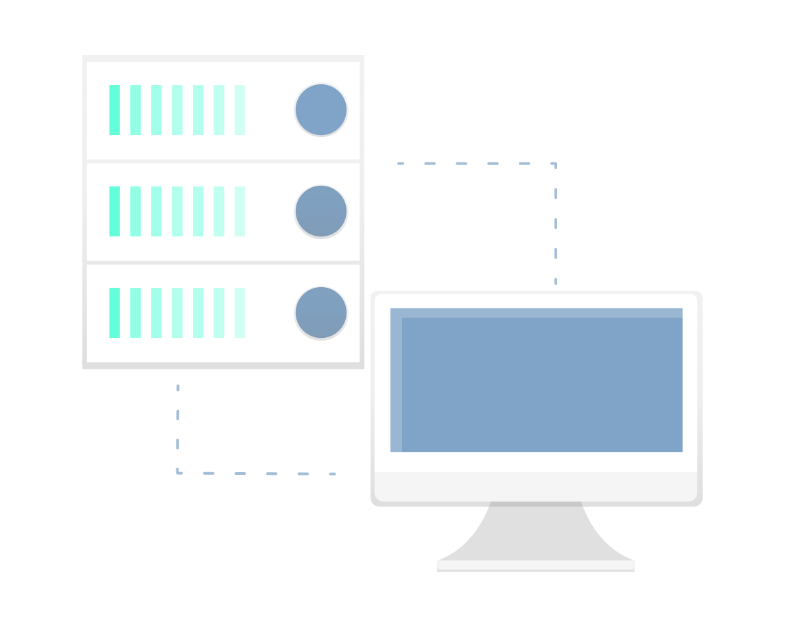

<h1 align="center">
   
  
   
     
        Estudando Node.js
   
</h1>

----

## Ambiente
Iniciei o estudo em Node.js para aprender a executar Javascript server-side.

----

## O programinha

A calculadora de média determina se uma aluna foi aprovada, reprovada ou vai para a recuperação.
Usei variavéis, operadores matemáticos e lógicos e condicionais.
Para retornar notas com casas decimais usei o parseFloat() e para exibir um resultado personalizado fiz uma concatenação de strings.

## Readline

Para pegar inputs no terminal instalei localmente o `readline-sync`.

